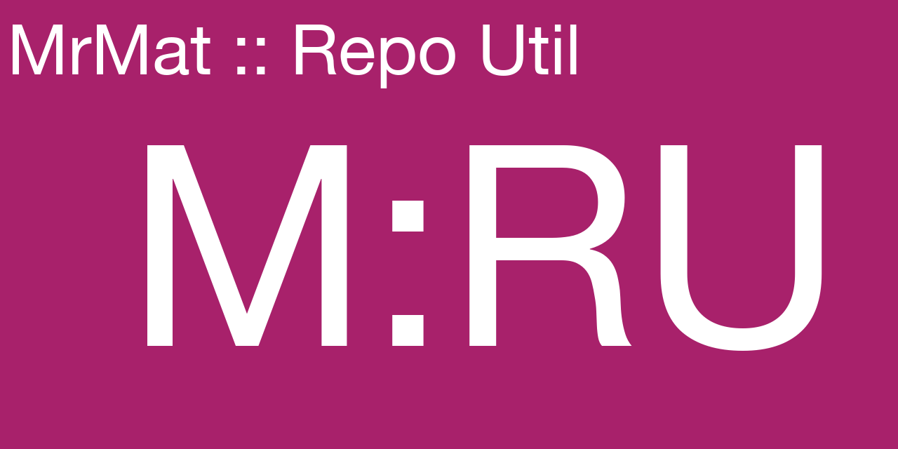
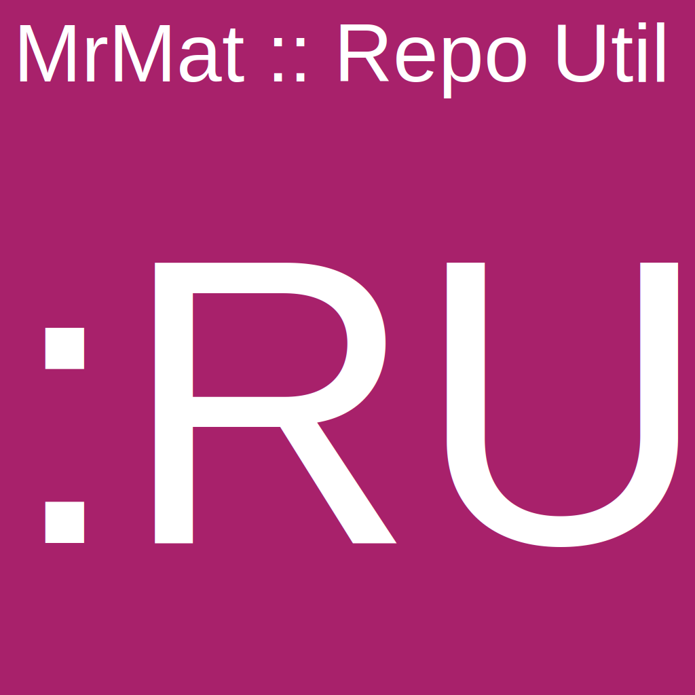

# MrMat :: Repository Utility

A utility tool to manage code repositories

## How to install this

Download the wheel from the releases page on GitHub or build it locally as per the interactive build section below. It
is recommended to install the tool in some virtual environment.

```shell
$ python -m venv /path/to/venv
$ pip install /path/to/downloaded/wheel
```

## How to use this

This is a utility kit for managing repositories in GitHub and Gitlab and the Jetbrains suite of IDEs. At this time, it
only has a single function, to generate the social media icons in GitHub and a custom project icon for Jetbrains.

### Getting help

A simple command help system is provided.

```shell
 mrmat-repo-util -h
usage: mrmat-repo-util [-h] {social-icons} ...

mrmat-repo-util - 0.0.0.dev0

positional arguments:
  {social-icons}
    social-icons  GitHub Social Icons

options:
  -h, --help      show this help message and exit
  
$ mrmat-repo-util social-icons -h
usage: mrmat-repo-util social-icons [-h] [-c {purple,red,orange,yellow,blue}] [--font-path FONT_PATH] [--font-family FONT_FAMILY] -t TITLE
                                    --headline HEADLINE [-d DIRECTORY]

options:
  -h, --help            show this help message and exit
  -c {purple,red,orange,yellow,blue}, --colour {purple,red,orange,yellow,blue}
                        Background color
  --font-path FONT_PATH
                        Path to the font to use. Defaults to /System/Library/Fonts/HelveticaNeue.ttc
  --font-family FONT_FAMILY
                        Font family to use. Defaults to Helvetica
  -t TITLE, --title TITLE
                        Title on the top-left corner
  --headline HEADLINE   Headline on the right
  -d DIRECTORY, --directory DIRECTORY
                        Directory to save the images to. Defaults to /Users/YOU/build
```

### Generating social icons

The tool will generate social icons you can upload to GitHub and use as a project icon for Jetbrains or in Gitlab.
GitHub social icons generated in PNG format at a size of 1280x640px. IDEA icons are generated in SVG format at
1024x1024px.

```shell
$ mrmat-repo-util --colour yellow --title "MrMat :: Repo Util" --headline "M:RU"
Generated GitHub social icon at /Users/YOU/build/github-social.png
Generated icon at /Users/YOU/build/idea-icon.svg
```

The resulting images look like this:




## How to build this

### Interactively

The generals sequence for building interactively is to install the necessary dependencies and build a wheel:

```shell
$ pip install -r requirements.dev.txt
$ pip install -r requirements.txt
$ PYTHONPATH=$(pwd)/src python -m build -n --wheel
```

> Modifying the PYTHONPATH is necessary so the dynamic version in `src/ci` can be found during the build process.

An interactive build will default its version to '0.0.0.dev0', which is a relevant piece of information telling us that
this was not a build that was produces in a (slightly) more trusted CI environment. Builds produced within a CI context
have 'real' version numbers based on the build number injected by GitHub.

### CI

GitHub Actions will trigger a build upon a push and as part of a pull request. If the build is the result of a merge 
onto the merge branch then it is considered to be a release build, which will cause a tag to be created. The version 
is suffixed with '.dev0' for any non-release build.

The build version is relayed via the 'MRMAT_VERSION' environment variable from the 'MAJOR', 'MINOR' operational 
variables as well as the 'GITHUB_RUN_NUMBER'. 'MAJOR' and 'MINOR' are meant to be adjusted manually because those are 
conscious version bumps that are expected to happen far less frequently than individual builds. The 'GITHUB_RUN_NUMBER' 
is injected by GitHub Actions itself, resulting in a discrete version of the product for each build.

The version constructed at build time is relayed by using a Python module in src/ci, which is referred to by 
pyproject.toml and explicitly excluded from the resulting distribution. Pythons importlib.metadata is then used in the 
top-level __init__.py for relaying the version into the runtime.

## Limitations

* It is not currently possible to specify custom colours beyond the hardcoded palette
* PNG and Pillow need the path to a TrueType font, SVG wants the name of the font face. It would be nice not having to specify the font twice
* We might as well use the GitHub/Gitlab APIs to upload the images directly instead of storing them locally
